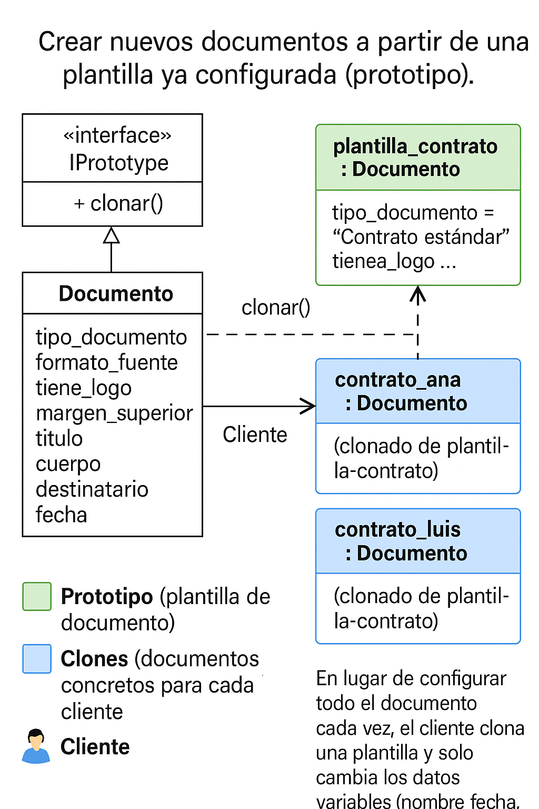

📄 Patrón Prototype – Plantillas de Documentos (Word/Google Docs)

Un patrón creacional para crear nuevos objetos copiando otros ya existentes, como cuando duplicas una plantilla de Word para generar un nuevo documento.

🧠 1. ¿Qué es el Patrón Prototype?

El patrón Prototype permite crear objetos mediante clonación, sin necesidad de construirlos desde cero.

Usa este patrón cuando:

Los objetos tienen muchas propiedades

Configurarlos es costoso

Repetir el proceso es ineficiente

Quieres mantener consistencia entre objetos similares

💡 Imagen mental:

Prototype es como tener una plantilla de documento ya configurada. Cuando creas un contrato nuevo, no partes desde cero, simplemente haces "Duplicar", cambias el nombre del cliente y listo.

📝 2. Analogía sencilla: Plantillas de Word

🌱 Prototipo (Plantilla):
Documento base ya configurado (márgenes, letra, estructura, logo…).

🌿 Clones:
Documentos nuevos creados a partir de la plantilla.

🌳 Cliente:
La persona que pide una copia cada vez que necesita un documento nuevo.

🧩 3. Arquitectura del Patrón (UML)
🖼️ Diagrama UML:

🧭 ¿Qué representa el UML?

Documento → Actúa como prototipo

clonar() → Genera copias independientes

Cliente → Solicita clonaciones cuando necesita nuevos documentos

Objetos clonados → Son documentos completos, con la misma estructura pero con contenido distinto

⚙️ 4. Escenarios implementados
🟩 4.1 Prototype aplicado correctamente

📁 aplicado/documento_prototype_correcto.py

✔ Usa deepcopy
✔ Cada clon es un objeto completamente independiente
✔ No hay efectos secundarios
✔ Se evita duplicación de código

Ejemplo de la vida real:

Haces copia del documento plantilla → escribes los datos del cliente → no alteras la plantilla original.

❌ 4.2 Anti-patrón: mal uso de Prototype

📁 mal_aplicado/documento_prototype_mal_aplicado.py

⚠ Usa copy.copy (clon superficial)
⚠ Cambios en el clon pueden afectar el prototipo
⚠ Es engañoso: parece Prototype pero está mal aplicado

Ejemplo de la vida real:

Cambias el logo en el documento del cliente… ¡y sin querer cambias el de la plantilla!

⚠️ 4.3 Sin patrón Prototype (creación manual)

📁 sin_patron/documento_sin_prototype.py

❌ Se repite código
❌ Riesgo de inconsistencias
❌ Difícil de mantener
❌ Configuración manual una y otra vez

Ejemplo real:

Abrir Word en blanco y empezar desde cero cada contrato.

▶️ 5. Cómo ejecutar los ejemplos
python aplicado/documento_prototype_correcto.py
python mal_aplicado/documento_prototype_mal_aplicado.py
python sin_patron/documento_sin_prototype.py

📊 6. Comparación entre escenarios
Criterio	Prototype Correcto	Anti-patrón	Sin Patrón
Reutilización	🟢 Alta	🟡 Media	🔴 Nula
Independencia	🟢 Sí	🔴 No	🔴 No
Facilidad de mantenimiento	🟢 Alta	🟡 Baja	🔴 Muy baja
Rendimiento	🟢 Óptimo	🟡 Dudoso	🔴 Ineficiente
Riesgo de errores	🔵 Bajo	🟡 Alto	🔴 Muy alto
🎤 7. Conclusión

El patrón Prototype:

Evita repetir código

Garantiza consistencia

Simplifica la creación de objetos similares

Hace el software más escalable

Reduce errores y tiempo de desarrollo

Es perfecto cuando necesitas crear objetos casi idénticos, como documentos, configuraciones o plantillas.

👥 8. Créditos

Ejemplo desarrollado con fines académicos para la sesión de Patrones Creacionales.