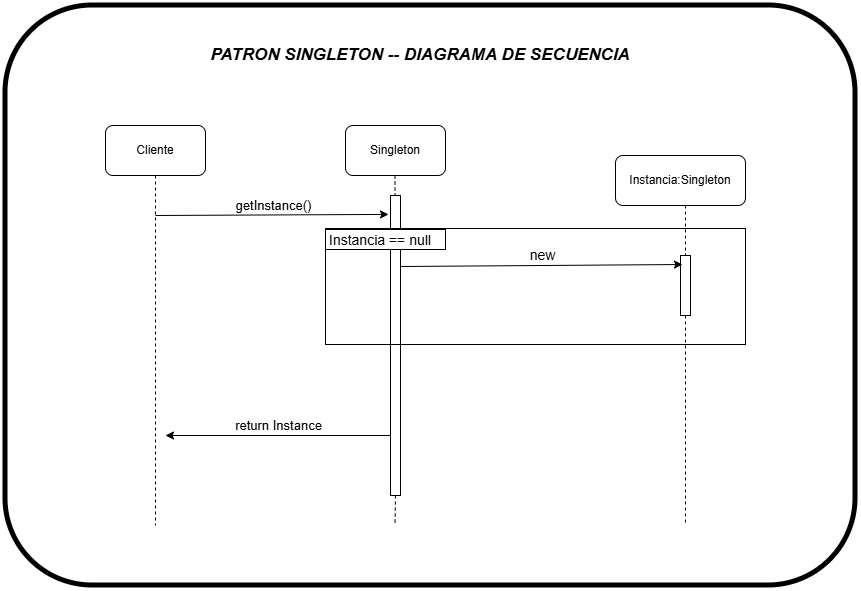

# 📊 Diagrama de Secuencia - Patrón Singleton

## Flujo de Llamadas - getInstance()



---

## 📋 Explicación del Diagrama Paso a Paso

### Actores Involucrados

| Actor | Rol |
|-------|-----|
| **Cliente** | Entidad que solicita la instancia Singleton |
| **Singleton** | Clase que implementa el patrón |
| **Instancia Singleton** | Objeto único creado y mantenido |

### Secuencia de Eventos

#### **Paso 1: Cliente solicita getInstance()**
```
Cliente -----> getInstance()
```
El cliente llama al método estático `getInstance()` del Singleton.

#### **Paso 2: Singleton verifica si existe instancia**
```
Singleton: ¿instancia == null?
```
El Singleton revisa si ya existe una instancia creada en memoria.

#### **Paso 3a: Primera llamada - crear instancia (instancia == null)**
```
Singleton -----> new -----> Instancia Singleton
```
Si es la primera llamada (instancia es `null`):
- Se crea una NUEVA instancia del objeto
- Se almacena en la variable de clase (`_instance` o `_instances`)

#### **Paso 3b: Llamadas posteriores - retornar existente (instancia != null)**
```
Singleton -----> return _instance
```
Si ya existe una instancia:
- Se retorna la instancia existente
- NO se crea una nueva

#### **Paso 4: Return Instance**
```
Singleton -----> return Instance -----> Cliente
```
El cliente recibe siempre la misma instancia (o `True` en comparación `is`).

---

## 🎯 Punto Clave del Diagrama

### La Garantía del Singleton

```
┌─────────────────────────────────────────────────────────┐
│  Primera llamada:     getInstance() → crea instancia   │
│                                                         │
│  Segunda llamada:     getInstance() → retorna MISMA    │
│  Tercera llamada:     getInstance() → retorna MISMA    │
│  N-ésima llamada:     getInstance() → retorna MISMA    │
└─────────────────────────────────────────────────────────┘
```

**Resultado garantizado:**
```python
gestor1 = GestorImpresion()
gestor2 = GestorImpresion()

gestor1 is gestor2  # ← SIEMPRE True (misma instancia)
```

---

## 🔐 Mecanismo de Sincronización

### Sin Thread-Safety (❌ Inseguro)
```
Thread-1: ¿instancia == null? Sí  → crea instancia #1
Thread-2: ¿instancia == null? Sí  → crea instancia #2
                    ↓
                ❌ DOS INSTANCIAS (se rompió el singleton)
```

### Con Thread-Safety (✅ Seguro)
```
Thread-1: Adquiere Lock ──┐
Thread-2: Espera Lock     ├─ Solo uno crea instancia
                          │
Thread-1: Libera Lock ────┘
Thread-2: Adquiere Lock → ve instancia existente → retorna
```

**Implementación en el proyecto:**
```python
from threading import Lock

@singleton  # ← El decorador usa Lock internamente
class GestorImpresion:
    _lock = Lock()
    _instance = None
    
    def __new__(cls):
        with cls._lock:  # ← Protección sincronizada
            if cls._instance is None:
                cls._instance = super().__new__(cls)
        return cls._instance
```

---

## 📌 Aplicación al Gestor de Impresión

### En Nuestro Contexto

```
┌─────────────────────────────────────────────────────────┐
│              INICIO DE LA APLICACION                    │
└─────────────────────────────────────────────────────────┘
                        │
                        ↓
    ┌──────────────────────────────────────┐
    │ Cliente: GestorImpresion()           │
    │ (Primera llamada)                    │
    └──────────────────────────────────────┘
                        │
                        ↓
    ┌──────────────────────────────────────┐
    │ ¿instancia == null? SÍ               │
    │ Crear: cola FIFO + Lock + estado     │
    └──────────────────────────────────────┘
                        │
                        ↓
    ┌──────────────────────────────────────┐
    │ Cliente 1: GestorImpresion()         │
    │ Cliente 2: GestorImpresion()         │
    │ Cliente 3: GestorImpresion()         │
    │ (Llamadas posteriores)               │
    └──────────────────────────────────────┘
                        │
                        ↓
    ┌──────────────────────────────────────┐
    │ ¿instancia == null? NO               │
    │ Retornar: LA MISMA instancia         │
    └──────────────────────────────────────┘
                        │
                        ↓
    ┌──────────────────────────────────────┐
    │ RESULTADO:                           │
    │ gestor1 is gestor2 is gestor3 → True │
    │ UNA SOLA COLA COMPARTIDA             │
    │ COORDINACION CENTRALIZADA            │
    └──────────────────────────────────────┘
```

---

## 💡 Analogía con el Mundo Real

### Sin Singleton (❌ Caos)
```
Empleado 1 → Crea su propia cola de impresión
Empleado 2 → Crea su propia cola de impresión
Empleado 3 → Crea su propia cola de impresión
             ↓
        Impresora recibe comandos de 3 colas
        ¿Cuál procesa primero? ¿Cuál tiene prioridad?
        → CONFLICTO Y CAOS
```

### Con Singleton (✅ Orden)
```
Empleado 1 ─┐
Empleado 2 ─├─ Todos usan LA MISMA cola
Empleado 3 ─┘
             ↓
        Una sola cola FIFO
        Impresora procesa en orden
        → ORDEN Y SEGURIDAD
```

---

## 🔗 Referencias en el Código

### Implementación del Decorador
📄 `src/singleton_decorator.py`

```python
def singleton(cls):
    """Decorador que implementa el patrón Singleton"""
    instances = {}
    lock = Lock()
    
    def get_instance(*args, **kwargs):
        with lock:  # ← Thread-safe
            if cls not in instances:
                instances[cls] = cls(*args, **kwargs)
        return instances[cls]
    
    return get_instance
```

### Uso en Gestor de Impresión
📄 `examples/ejemplo_gestor_impresion.py`

```python
@singleton  # ← Decorador aplicado
class GestorImpresion:
    def enviar_trabajo(self, empleado, documento, paginas):
        # Una cola centralizada
        self.cola_trabajos.append(...)
    
    def procesar_cola(self):
        # Procesa en orden FIFO
        while self.cola_trabajos:
            trabajo = self.cola_trabajos.popleft()
            self._imprimir(trabajo)
```

---

## 📚 Conceptos Clave

| Concepto | Significado |
|----------|------------|
| **getInstance()** | Método que retorna la instancia única (o decorador que lo hace) |
| **Lock / Mutex** | Mecanismo de sincronización para evitar race conditions |
| **Thread-Safe** | Garantiza funcionamiento correcto en ambientes multihilo |
| **FIFO** | First In, First Out - orden de procesamiento de la cola |
| **Double-Checked Locking** | Verificación de instancia antes y después de adquirir el lock |

---

## ✅ Verificación Final

Para verificar que el Singleton funciona correctamente en tu proyecto:

```bash
# Ejecutar el ejemplo
python examples/ejemplo_gestor_impresion.py

# Ejecutar los tests
python -m unittest tests.test_singleton -v
```

**Esperado:**
- Todos los tests pasan ✓
- Todas las referencias del gestor apuntan a la misma instancia
- Los trabajos se procesan en orden FIFO
- No hay conflictos ni datos perdidos

---

## 🎓 Lectura Complementaria

- 📄 `MAPAS_MENTALES_SINGLETON.md` - Visualización de conflictos y soluciones
- 📄 `README_COMPARACION.md` - Comparación detallada SIN vs CON Singleton
- 📄 `RESUMEN_GESTOR_IMPRESION.md` - Resumen ejecutivo del patrón

---

**Diagrama original:** Patrón Singleton - Diagrama de Secuencia UML  
**Contexto:** Implementación en Python para Gestor de Impresión  
**Fecha:** Noviembre 2025
